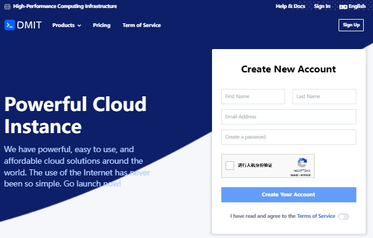

# DMIT Los Angeles VPS Upgrades to AMD EPYC 9005 Platform: Premium Plans Fully Renewed with Enhanced Performance and Network Routes

---

When you're running cross-border businesses or hosting high-traffic applications, you need a VPS that doesn't make you babysit it every day. DMIT just rolled out their new AMD EPYC 9005 platform in Los Angeles, bringing serious hardware muscle to their Premium and Eyeball series. Think faster processing, better virtualization efficiency, and CN2 GIA routing that actually delivers on its promises—around 140-160ms ping to mainland China, which is pretty solid for trans-Pacific connections.

If you're already using their LAX nodes (except those budget WEE or PalmSpring deals), you're getting this upgrade for free. No migration headaches, no surprise bills. Just better performance when you need it most.

---

## Network Routes and Return Path Optimization

DMIT's Los Angeles Premium series runs on **CN2 GIA premium routes**. The outbound traffic performs consistently well across all three major carriers. China Telecom users get direct CN2 GIA connections both ways, keeping things smooth and predictable. Average ping hovers around **140-160ms** to mainland China—stable enough that you won't be dealing with random spikes during peak hours.

One thing to note: the LAX Pro plans route some IPv6 traffic through **AS4134**, so if you're relying heavily on IPv6, just keep that in mind.

### IP Quality and Content Unlocking

Here's what works and what doesn't with DMIT's IP addresses:

- ✅ **Fully unlocked:** TikTok, YouTube, Amazon Prime Video, Spotify, ChatGPT
- ⚠️ **Partially unlocked:** Netflix (originals only)
- ❌ **Not unlocked:** Disney+

For most developers and businesses needing low-latency access to China, these Premium plans hit the sweet spot. Whether you're running development environments, hosting cross-border websites, or managing traffic relay services, the combination of AMD EPYC 9655 processors and CN2 GIA routing gives you room to scale without constant optimization tweaks.

👉 If you're tired of dealing with inconsistent network performance or CPU throttling during traffic spikes, [DMIT's Premium plans with AMD EPYC 9005 and CN2 GIA routing handle high-concurrency workloads without breaking a sweat](https://www.dmit.io/aff.php?aff=13832). The new platform means your VPS actually has headroom when you need it—not just on paper, but when real traffic hits.

## Los Angeles Eyeball – AN5 Platform

The Eyeball series uses multi-ISP load balancing routes, spreading traffic across different providers to maintain connection stability even when individual carriers hit congestion. This approach works well for applications that need consistent uptime but don't require the absolute lowest latency that CN2 GIA provides.

The AN5 platform brings the same AMD EPYC 9655 processors to Eyeball plans, so you're getting modern CPU architecture regardless of which series you choose. The main difference comes down to routing philosophy: Premium focuses on premium direct routes, while Eyeball distributes load for redundancy.

## Traffic and Speed Policies

DMIT structures their bandwidth policies to match real-world usage patterns rather than artificial caps that trigger unexpectedly. The Premium plans prioritize consistent speeds for sustained workloads, while Eyeball plans optimize for burst traffic scenarios with their load-balanced approach.

For high-traffic applications or content delivery, understanding these policies helps you pick the right plan upfront instead of discovering limits mid-deployment. The AMD EPYC 9005 platform handles these traffic patterns more efficiently than previous generations, meaning less CPU overhead even during peak bandwidth usage.

## Conclusion

DMIT's upgrade to the AMD EPYC 9005 platform across their Los Angeles Premium and Eyeball series brings real improvements where they matter: processing power and network stability. The combination of modern CPU architecture and mature CN2 GIA routing creates a solid foundation for compute-intensive tasks, streaming services, and cross-border enterprise applications.

👉 Whether you're scaling a development environment or running production workloads that can't afford downtime, [DMIT's Premium plans deliver the performance consistency and network quality that makes infrastructure feel invisible—which is exactly what good hosting should do](https://www.dmit.io/aff.php?aff=13832).
